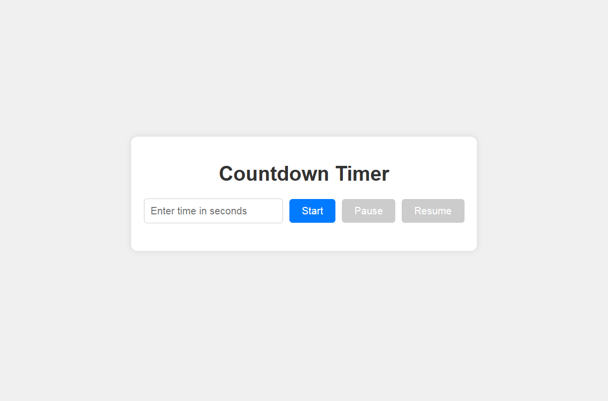

# Countdown Timer 

[live](https://countdown-timer-gamma-lime.vercel.app/)



A web-based countdown timer that allows users to input a time in seconds and control the countdown with start, pause, and resume functionalities.

## Features

- **Start Countdown:** Initiate the countdown based on user-defined seconds.
- **Pause Countdown:** Temporarily halt the countdown at its current time.
- **Resume Countdown:** Continue the countdown from where it was paused.
- **Responsive Design:** Ensures optimal viewing experience across various devices.

## Project Structure

The project consists of the following files:

- `index.html`: Defines the HTML structure of the countdown timer interface.
- `style.css`: Contains CSS styles to enhance the visual appearance and layout.
- `script.js`: Implements the timer's functionality using JavaScript.

## Getting Started

To use or modify this countdown timer:

1. **Clone the Repository:**

   ```bash
   git clone https://github.com/yourusername/countdown-timer.git](https://github.com/Dikshant-Koriwar/Countdown-Timer.git
   ```


2. **Navigate to the Project Directory:**

   ```bash
   cd countdown-timer
   ```


3. **Open the `index.html` File:**

   Open `index.html` in your preferred web browser to view and interact with the timer.

## Usage

- **Start the Countdown:** Enter the desired time in seconds and click the "Start" button.
- **Pause the Countdown:** Click the "Pause" button to halt the countdown.
- **Resume the Countdown:** Click the "Resume" button to continue the countdown from where it was paused.

## Customization

- **Styling:** Modify `style.css` to change colors, fonts, or layout to fit your design preferences.
- **Functionality:** Edit `script.js` to add new features or alter existing behaviors.

## Contributing

Contributions are welcome! To contribute:

1. **Fork the Repository**
2. **Create a New Branch:**

   ```bash
   git checkout -b feature/your-feature-name
   ```


3. **Commit Your Changes:**

   ```bash
   git commit -m 'Add your feature description'
   ```


4. **Push to the Branch:**

   ```bash
   git push origin feature/your-feature-name
   ```


5. **Open a Pull Request**

## License

This project is licensed under the MIT License. See the `LICENSE` file for details.

